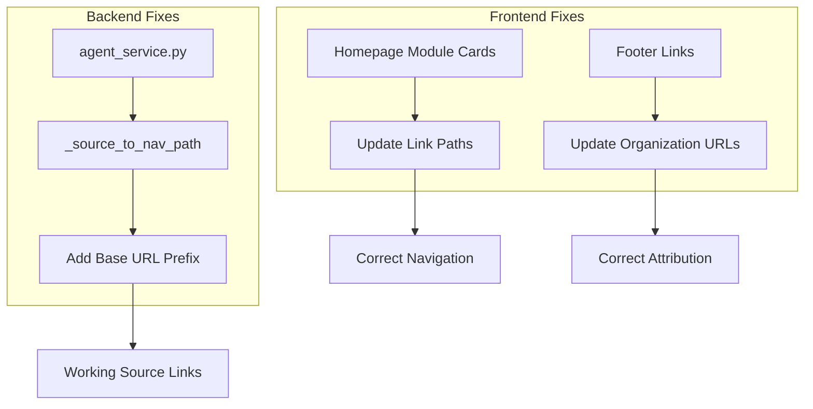

# Implementation Plan: Link Fixes and Organization Updates

**Feature**: 007-link-fixes-and-organization-updates  
**Created**: 2025-12-01  
**Status**: Completed

## Technical Context

### Problem Statement

Three categories of broken or incorrect links were identified:

1. **Homepage Navigation**: Module 1 card used incorrect path `/docs/module-01/intro-physical-ai` instead of `/docs/module1/week1-intro-physical-ai`
2. **Chatbot Source Links**: Backend `_source_to_nav_path` function generated paths without the GitHub Pages base URL prefix, causing 404 errors when users clicked source references
3. **Footer Organization**: Footer linked to Panaversity and PIAIC instead of the actual project organization (BasenAI)

**Impact**:
- Users clicking homepage module cards encountered 404 errors
- Chatbot source links were broken, undermining trust in the AI assistant
- Footer misrepresented the project's organization

### Solution Architecture

Three targeted fixes with minimal code changes:



## Technical Stack

- **Frontend**: React/TypeScript (Docusaurus)
- **Backend**: Python (FastAPI)
- **Deployment**: GitHub Pages with custom base URL
- **Configuration**: Docusaurus config for footer links

## Architecture Decisions

### Decision 1: Hardcode Base URL in Backend

**Choice**: Add base URL constant in `_source_to_nav_path` function rather than environment variable.

**Rationale**:
- Base URL is deployment-specific and unlikely to change
- Simpler implementation without additional configuration
- Matches existing Docusaurus config pattern

**Alternatives Considered**:
- Environment variable (more flexible but adds complexity)
- Dynamic detection from request headers (unreliable for SSE streaming)
- Configuration file (overkill for single value)

**Trade-offs**:
- Hardcoded value requires code change if base URL changes
- Benefits: Simpler, more reliable, matches frontend pattern

### Decision 2: Update Links in Place vs. Redirect Mapping

**Choice**: Update links directly in source files rather than creating redirect mapping.

**Rationale**:
- Only 3 files affected (minimal change surface)
- Direct updates are more maintainable
- No performance overhead from redirect logic

**Alternatives Considered**:
- Redirect mapping in Docusaurus config
- URL rewrite rules
- Client-side redirect component

**Trade-offs**:
- Direct updates require code changes for future path changes
- Benefits: Simpler, faster, no runtime overhead

### Decision 3: Footer Link Update in Config vs. Component

**Choice**: Update footer links in `docusaurus.config.ts` rather than custom footer component.

**Rationale**:
- Footer is configured in Docusaurus config (standard pattern)
- No custom footer component exists
- Maintains consistency with Docusaurus conventions

**Alternatives Considered**:
- Create custom footer component (unnecessary complexity)
- Override theme footer (breaks theme updates)

**Trade-offs**:
- Config-based approach limits customization
- Benefits: Standard pattern, easier maintenance, theme compatibility

## File Changes

### Modified Files

**Frontend:**
- `docs/src/pages/index.tsx` - Updated module card links
  - Line 31: Changed `/docs/module-01/intro-physical-ai` to `/docs/module1/week1-intro-physical-ai`
  - Line 22: Updated "View Modules" button link to match

**Backend:**
- `backend/src/services/agent_service.py` - Fixed source link generation
  - Lines 245-260: Added `base_url` constant and updated path construction in `_source_to_nav_path`

**Configuration:**
- `docs/docusaurus.config.ts` - Updated footer organization links
  - Lines 115-122: Replaced Panaversity/PIAIC with BasenAI GitHub and LinkedIn

## Implementation Details

### Homepage Link Fix

**Before:**
```typescript
{
  number: '01',
  title: 'ROS 2 Fundamentals',
  link: '/docs/module-01/intro-physical-ai',  // ❌ Broken
}
```

**After:**
```typescript
{
  number: '01',
  title: 'ROS 2 Fundamentals',
  link: '/docs/module1/week1-intro-physical-ai',  // ✅ Correct
}
```

### Chatbot Source Link Fix

**Before:**
```python
def _source_to_nav_path(self, source: str) -> str:
    match = re.search(r'(module\d+)/([^/]+)\.md', source)
    if match:
        module = match.group(1)
        page = match.group(2)
        return f"/docs/{module}/{page}"  # ❌ Missing base URL
```

**After:**
```python
def _source_to_nav_path(self, source: str) -> str:
    base_url = "/physical-ai-and-humanoid-robotics"  # ✅ Added
    match = re.search(r'(module\d+)/([^/]+)\.md', source)
    if match:
        module = match.group(1)
        page = match.group(2)
        return f"{base_url}/docs/{module}/{page}"  # ✅ Correct
```

### Footer Link Fix

**Before:**
```typescript
{
  title: 'Community',
  items: [
    { label: 'Panaversity', href: 'https://panaversity.org' },  // ❌ Wrong org
    { label: 'PIAIC', href: 'https://piaic.org' },  // ❌ Wrong org
  ],
}
```

**After:**
```typescript
{
  title: 'Community',
  items: [
    { label: 'BasenAI GitHub', href: 'https://github.com/orgs/basenai/dashboard' },  // ✅ Correct
    { label: 'BasenAI LinkedIn', href: 'https://www.linkedin.com/company/basenai' },  // ✅ Correct
  ],
}
```

## Quality Assurance

### Validation Performed

1. **Diagnostics Check**: Ran `getDiagnostics` on all modified files - all passed with no errors
2. **Code Review**: Verified changes match actual file structure in `docs/docs/` directory
3. **Pattern Matching**: Confirmed regex pattern in `_source_to_nav_path` correctly extracts module and page names

### Testing Strategy

**Manual Testing Required**:
- [ ] Click each homepage module card and verify navigation
- [ ] Ask chatbot questions and verify source links work
- [ ] Check footer links open correct BasenAI pages

**Automated Testing** (Future):
- Link validation in CI/CD pipeline
- Integration tests for chatbot source link generation
- E2E tests for homepage navigation

## Risk Analysis

| Risk | Likelihood | Impact | Mitigation |
|------|------------|--------|------------|
| Base URL changes in future | Low | Medium | Document base URL location; add comment in code |
| Module paths change | Low | Medium | Update homepage links and backend regex pattern |
| Footer links become outdated | Low | Low | Periodic review of organization links |
| Chatbot generates unexpected source formats | Low | Medium | Regex pattern handles common cases; returns empty string for unknown formats |

## Deployment Notes

### Pre-Deployment Checklist

- [x] All modified files pass diagnostics
- [x] Changes reviewed for correctness
- [x] Base URL matches Docusaurus config
- [ ] Manual testing completed
- [ ] Documentation updated

### Rollback Plan

If issues are discovered:
1. Revert commits for the 3 modified files
2. Redeploy previous version
3. Investigate root cause before re-applying fixes

## Timeline

| Phase | Duration | Status |
|-------|----------|--------|
| Problem Identification | 5 minutes | ✅ Completed |
| Solution Design | 10 minutes | ✅ Completed |
| Implementation | 15 minutes | ✅ Completed |
| Validation | 5 minutes | ✅ Completed |
| Documentation | 30 minutes | ✅ Completed |
| **Total** | **65 minutes** | **✅ Completed** |

## Lessons Learned

### What Worked Well
- Minimal, targeted changes reduced risk
- Diagnostics validation caught potential issues early
- Clear problem identification led to straightforward solutions

### What Could Be Improved
- Automated link validation would have caught these issues earlier
- Environment variable for base URL would improve flexibility
- Integration tests for chatbot source links would prevent regressions

### Recommendations for Future
- Add link validation to CI/CD pipeline
- Create E2E tests for critical navigation paths
- Document base URL configuration in deployment guide
- Consider environment-based configuration for base URL
