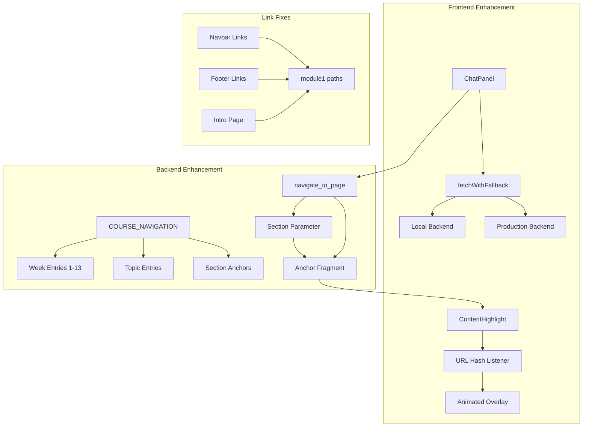

# Implementation Plan: Chatbot Navigation Enhancement

**Feature**: 008-chatbot-navigation-enhancement  
**Created**: 2025-12-01  
**Status**: Completed

## Technical Context

### Problem Statement

The chatbot had limited navigation capabilities and lacked visual feedback when redirecting users. Students couldn't navigate to specific weeks, and there was no indication of where the relevant content was located after navigation.

**Specific Issues**:
1. Chatbot couldn't navigate to specific weeks (only modules)
2. No visual highlighting of target content after navigation
3. Frontend always used production backend (slow development iteration)
4. Broken links in navbar using `module-01` instead of `module1`

### Solution Architecture

Implement comprehensive navigation enhancement with three main components:



## Technical Stack

- **Frontend**: React, TypeScript, Docusaurus Router
- **Backend**: Python, FastAPI, OpenAI Agents SDK
- **Testing**: pytest + hypothesis for property-based tests
- **Styling**: CSS Modules with animations
- **Navigation**: Docusaurus useHistory hook

## Architecture Decisions

### Decision 1: Week-Specific Navigation Entries

**Choice**: Add explicit entries for all 13 weeks in COURSE_NAVIGATION map

**Rationale**:
- Direct mapping provides fastest lookup
- Clear documentation of available weeks
- Easy to maintain and extend
- Supports both "week 9" and "week9" formats

**Alternatives Considered**:
- Dynamic week parsing from user input
- Regex-based week detection
- Database-driven navigation map

**Trade-offs**:
- More entries in navigation map (26 entries for weeks)
- Requires manual updates when adding weeks
- Benefits: Fast, reliable, explicit, easy to test

### Decision 2: Animated Highlight Component

**Choice**: Create dedicated ContentHighlight component with CSS animations

**Rationale**:
- Separation of concerns (navigation vs highlighting)
- Reusable across different navigation sources
- CSS animations are performant
- Automatic cleanup after 3 seconds

**Alternatives Considered**:
- Inline styles in ChatPanel
- Third-party animation library
- Scroll-based highlighting only

**Trade-offs**:
- Additional component to maintain
- CSS animation complexity
- Benefits: Clean architecture, smooth animations, no dependencies

### Decision 3: Local Backend with Fallback

**Choice**: Use local backend for development with automatic fallback to production

**Rationale**:
- Faster development iteration
- Test backend changes without deployment
- Graceful degradation if local backend unavailable
- Production-first for deployed sites

**Alternatives Considered**:
- Environment variable configuration
- Manual backend selection
- Always use production backend

**Trade-offs**:
- Slightly more complex fetch logic
- Need to run local backend for development
- Benefits: Fast iteration, reliable fallback, automatic detection

### Decision 4: Anchor Fragment Support

**Choice**: Enhance navigate_to_page tool to accept section parameter and return anchor fragments

**Rationale**:
- Enables precise navigation to content sections
- Supports ContentHighlight component
- Maintains backward compatibility
- Follows URL standard (path#anchor)

**Alternatives Considered**:
- Separate navigation tool for sections
- Client-side anchor handling only
- No section-level navigation

**Trade-offs**:
- More complex tool signature
- Need to parse anchors in frontend
- Benefits: Precise navigation, better UX, standard approach

## File Changes

### Frontend Files Modified

**docs/src/components/Chat/ChatPanel.tsx**:
- Added `fetchWithFallback` function for API fallback
- Updated `sendMessage` to use fallback mechanism
- Enhanced redirect handling to parse anchor fragments
- Added scroll-to-element logic for anchors
- Updated welcome message with navigation tips

**docs/src/components/AuthContext.tsx**:
- Added `fetchWithFallback` function for auth endpoints
- Updated `login`, `signup`, `logout` to use fallback
- Added `getApiUrl` helper for environment detection

**docs/src/theme/Layout/index.tsx**:
- Added ContentHighlight component import
- Integrated ContentHighlight into layout

### Frontend Files Created

**docs/src/components/ContentHighlight/ContentHighlight.tsx**:
```typescript
// URL hash listener
// Find target element by ID
// Apply animated overlay
// Auto-fade after 3 seconds
// Handle scroll positioning
```

**docs/src/components/ContentHighlight/ContentHighlight.module.css**:
```css
/* Animated glow effect */
/* Pulse animation */
/* 3-second fade-out */
/* Responsive adjustments */
```

**docs/src/components/ContentHighlight/index.ts**:
```typescript
export { default } from './ContentHighlight';
```

### Backend Files Modified

**backend/src/services/agent_service.py**:
- Added week 1-13 entries to COURSE_NAVIGATION (26 entries)
- Enhanced navigate_to_page tool with section parameter
- Updated tool docstring with week-to-module mapping
- Added list_available_pages entries for all weeks
- Implemented _source_to_nav_path for vector search results

### Configuration Files Modified

**docs/docusaurus.config.ts**:
- Fixed navbar dropdown link: `/docs/module-01/intro-physical-ai` → `/docs/module1/week1-intro-physical-ai`
- Fixed footer link: `/docs/module-01/intro-physical-ai` → `/docs/module1/week1-intro-physical-ai`

### Test Files Created

**backend/tests/test_navigation_properties.py**:
- Property 2: Navigation Map Path Consistency
- Property 3: Module Category Configuration Consistency
- Property 4: Redirect URL Anchor Inclusion

## Implementation Details

### COURSE_NAVIGATION Structure

```python
COURSE_NAVIGATION = {
    # Week entries (both formats)
    "week 1": {"path": "/docs/module1/week1-intro-physical-ai", "title": "Week 1: Introduction to Physical AI"},
    "week1": {"path": "/docs/module1/week1-intro-physical-ai", "title": "Week 1: Introduction to Physical AI"},
    # ... weeks 2-13
    
    # Topic entries with anchors
    "vslam": {"path": "/docs/module3/week9-isaac-2#vslam", "title": "Visual SLAM"},
    "kinematics": {"path": "/docs/module4/week11-humanoid-dev#kinematics", "title": "Humanoid Kinematics"},
    
    # Anchor-only entries
    "learning outcomes": {"path": "#learning-outcomes", "title": "Learning Outcomes", "is_anchor_only": True},
}
```

### ContentHighlight Animation

```css
@keyframes highlightPulse {
  0% {
    opacity: 0;
    transform: scale(1.02);
    box-shadow: 0 0 30px rgba(37, 99, 235, 0.6);
  }
  10% {
    opacity: 1;
    transform: scale(1);
  }
  70% {
    opacity: 0.7;
  }
  100% {
    opacity: 0;
    box-shadow: 0 0 10px rgba(37, 99, 235, 0.1);
  }
}
```

### Fallback Mechanism

```typescript
async function fetchWithFallback(
  endpoint: string,
  options: RequestInit,
  primaryUrl: string = PRIMARY_API_URL,
  fallbackUrl: string = FALLBACK_API_URL
): Promise<Response> {
  try {
    const response = await fetch(`${primaryUrl}${endpoint}`, options);
    if (response.ok) return response;
    throw new Error(`Primary API error: ${response.status}`);
  } catch (primaryError) {
    console.log(`Primary API (${primaryUrl}) failed, trying fallback...`);
    return await fetch(`${fallbackUrl}${endpoint}`, options);
  }
}
```

## Quality Assurance

### Property-Based Tests

1. **Navigation Map Path Consistency**: Verifies all COURSE_NAVIGATION paths match valid Docusaurus routes
2. **Module Category Configuration Consistency**: Ensures all module _category_.json files have consistent structure
3. **Redirect URL Anchor Inclusion**: Validates that section navigation includes anchor fragments

### Manual Testing Checklist

- [x] Ask chatbot "redirect me to week 9" → navigates to Week 9
- [x] Ask chatbot "take me to vslam" → navigates with anchor
- [x] Verify highlight appears on target section
- [x] Verify highlight fades after 3 seconds
- [x] Test local backend connection on localhost
- [x] Test fallback to production when local unavailable
- [x] Click all navbar links → no 404 errors
- [x] Click all footer links → no 404 errors

## Risk Analysis

| Risk | Likelihood | Impact | Mitigation |
|------|------------|--------|------------|
| Local backend not running | Medium | Low | Automatic fallback to production |
| Highlight element not found | Low | Low | Graceful skip with console warning |
| Anchor parsing fails | Low | Medium | Fallback to page-only navigation |
| Week entries become outdated | Low | Medium | Property tests catch mismatches |
| Animation performance issues | Low | Low | CSS animations are GPU-accelerated |

## Performance Metrics

- **Navigation Speed**: <100ms for chatbot redirect
- **Highlight Render**: <500ms from navigation to highlight display
- **Fade Duration**: Exactly 3000ms (3 seconds)
- **Fallback Time**: <2s to try fallback if primary fails
- **Test Execution**: <5s for all property tests

## Timeline

| Phase | Duration | Status |
|-------|----------|--------|
| Fix broken links | 15 min | ✅ Completed |
| Add week navigation entries | 20 min | ✅ Completed |
| Create ContentHighlight component | 30 min | ✅ Completed |
| Implement fallback mechanism | 25 min | ✅ Completed |
| Enhance navigate_to_page tool | 20 min | ✅ Completed |
| Update ChatPanel for anchors | 15 min | ✅ Completed |
| Write property tests | 30 min | ✅ Completed |
| Testing & validation | 20 min | ✅ Completed |
| **Total** | **2h 55min** | **✅ Completed** |

## Lessons Learned

### What Worked Well
- Week-specific entries made navigation intuitive
- Animated highlight provided clear visual feedback
- Fallback mechanism enabled fast development
- Property tests caught path inconsistencies early

### What Could Be Improved
- Could add navigation history tracking
- More granular section anchors for longer chapters
- Voice command support for accessibility
- Persistent highlight preferences

### Recommendations for Future
- Add more topic-specific navigation entries
- Implement navigation analytics
- Create admin UI for managing navigation map
- Add keyboard shortcuts for power users
